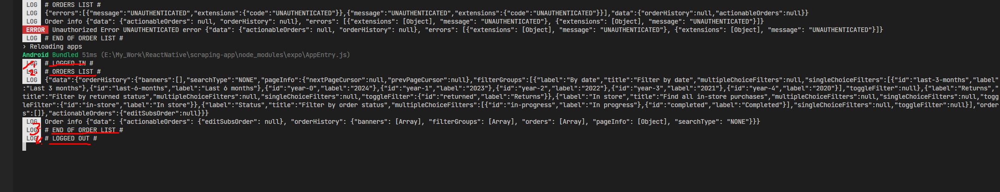

# Scraping Mobile App

This Expo React Native application is designed to scrape the orders list from walmart.com after logging in. It utilizes various Expo and React Native libraries for development and functionality.

## My Approach and Additional Notes 

### 01. Authentication Pattern 

Walmart relies on GraphQL queries to access resources. Authentication is achieved through the utilization of headers such as `cookie`, `x-apollo-operation-name`, `x-o-platform`, `x-o-platform-version`, and `x-o-segment`.

### 02. SDK/Engine 

I've developed a JavaScript SDK designed to be injected into websites via `WebView`. This SDK monitors changes in `cookies`, facilitating the detection of login or logout events. Upon detection, messages are dispatched to the React Native app. Additionally, our SDK intercepts calls to the `/orders` endpoint, passing authenticated information, including cookies, to the React Native app.

### 03. Mobile App

In our mobile app, incoming messages with defined types trigger specific data processing routines. For instance, upon receiving a message, we may render console logs or execute requests to retrieve additional information outside of the `WebView`.

### 04. Tests

To ensure the reliability of our system, we've implemented tests that mock the WebView component to simulate message posting. We've also mocked `fetch` and `console.log` to verify the expected behavior of our logic.

### 05. Error Handling 

Our error handling strategy involves defining various error types in `services/error.ts`. Each error type corresponds to a specific scenario, allowing us to display appropriate error messages to users.

### 06. Additional Notes

Due to the absence of order data in our account, pagination functionality has not been implemented. However, we've created an endpoint, `/purchaseHistory`, located outside of the WebView, to demonstrate our understanding of the authentication flow and to facilitate the retrieval of order details. Once we've verified the authentication flow, extending functionality to include additional API requests will be straightforward.


## How to run? 

### Install packages

```
npm install
```

### Run App

```
npm run web
```

You can scan QR code on your mobile app after running the above command. WebView is not working on web. 

### How to run test 

```
npm run test
```

### Result



## Plan to extend and improve this integration 

### Employed Open-Closed principle in services. 

The application adheres to the Open-Closed principle within its services. Currently, integration with Walmart is the primary focus, but future integrations with other platforms are anticipated. To facilitate seamless extension, new integrations can be easily incorporated by creating a new class that inherits from the base abstract class without necessitating modifications to already integrated platforms.

### Separate SDKs/Injected JS Code

The strategy involves injecting JavaScript code into the application, triggering message emissions for platform events such as login, logout, and interception of the `/orders` endpoint. However, integration requires the injection of JavaScript code as a string into the `WebView` component. To enhance maintainability and facilitate testing, I propose splitting the repository to include separate SDKs for each integrated platform. This approach allows for the creation of comprehensive end-to-end or unit tests for individual SDKs.
